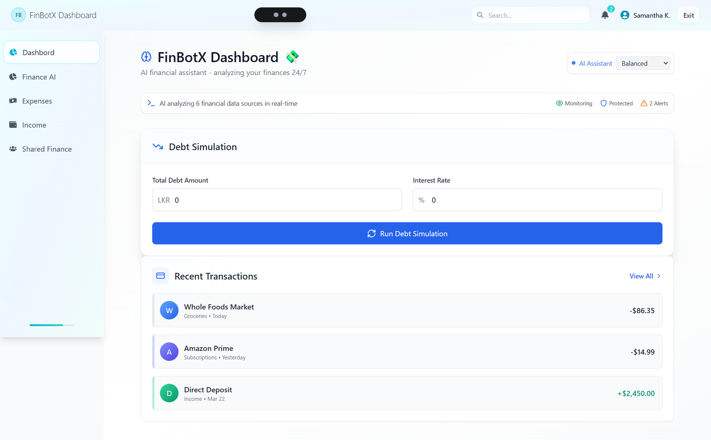

# 
# 💸 FinBotX – Your Intelligent Financial Assistant

[](LICENSE)


FinBotX is a modern and intelligent **personal finance assistant** web app built to help users track expenses, manage transactions, and gain smart insights into their spending habits. Whether you're budgeting or analyzing patterns, FinBotX offers a smooth and intuitive experience.

---

## 🚀 Features

- ✅ Add and categorize income/expenses
- 📊 Visualize spending patterns with charts and summaries
- 🔍 View and filter past transactions
- 🔔 Budgeting alerts and overspending notifications
- 🧠 AI-powered insights (planned)
- 🧾 Download reports (planned)

---

## 🛠️ Tech Stack

- **Frontend**: React, Tailwind CSS
- **Backend**: Node.js, Express.js
- **Database**: MongoDB (Mongoose)
- **Authentication**: JWT (planned)

---

## 📦 Installation

### 1. Clone the repository
```bash
git clone https://github.com/GPSNawamina/FinBotx.git
cd FinBotx


